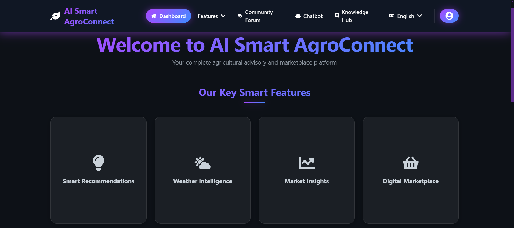
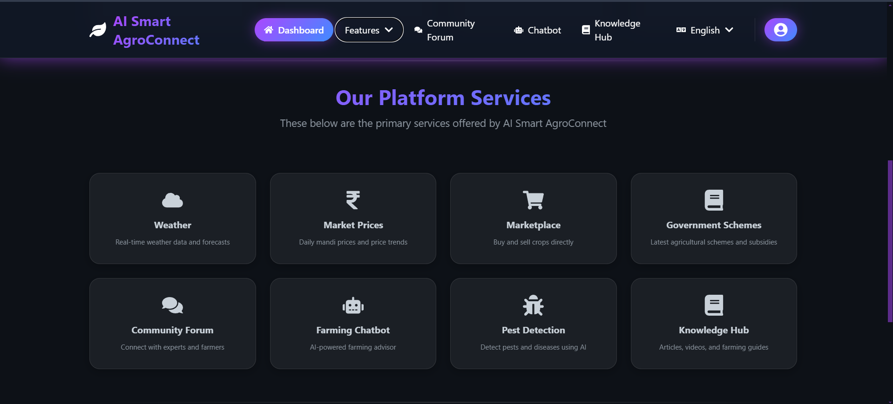
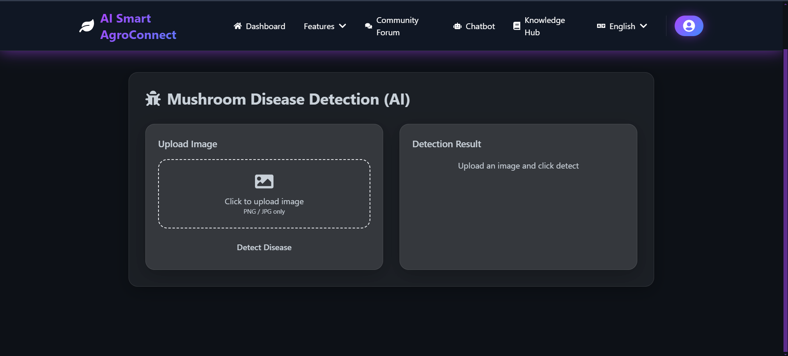
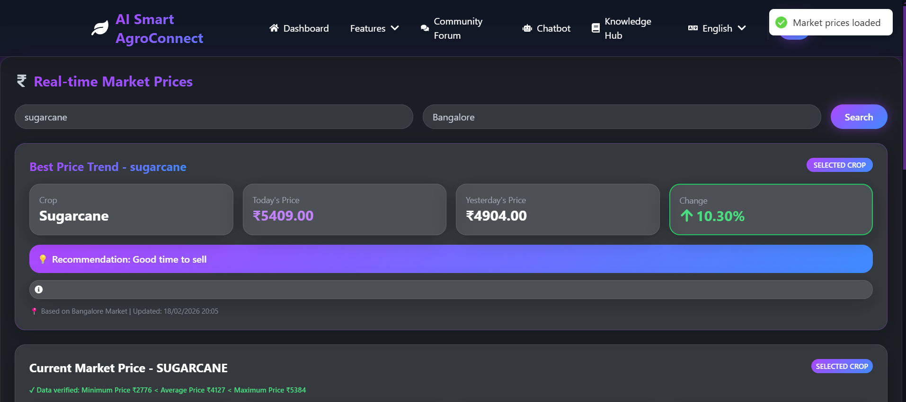

# AI Smart AgroConnect 🌾

A comprehensive AI-powered digital agriculture platform designed to empower farmers, buyers, and agricultural experts with intelligent tools for crop disease detection, real-time weather forecasting, market intelligence, and direct farmer-buyer marketplace.

---

## 📸 Screenshots

<!-- Add your screenshots here -->

|             Home Page              |                Dashboard                |
| :--------------------------------: | :-------------------------------------: |
|  |  |

|                  Pest Detection                   |                 Marketplace                 |
| :-----------------------------------------------: | :-----------------------------------------: |
|  |  |

---

## 🚀 Features

- **🔬 AI-Powered Pest Detection** - CNN-based crop disease identification with 90%+ accuracy across 22+ diseases
- **🌤️ Real-Time Weather** - Live weather forecasts and farming alerts using OpenWeatherMap API
- **📊 Market Price Tracking** - Live mandi prices across multiple states with trend analysis
- **🛒 P2P Marketplace** - Direct farmer-to-buyer platform eliminating middlemen
- **🏛️ Government Schemes** - Centralized portal for agricultural schemes and eligibility checking
- **🤖 AI Chatbot** - 24/7 Groq AI-powered farming assistant for instant help
- **💬 Community Forum** - Farmer discussions and knowledge sharing
- **📚 Knowledge Hub** - Agricultural articles, guides, and best practices
- **🌐 Multi-Language Support** - Regional language support for rural accessibility

---

## 🛠️ Tech Stack

### Frontend

| Technology   | Purpose              |
| ------------ | -------------------- |
| React.js     | UI Framework         |
| Tailwind CSS | Styling              |
| React Router | Navigation           |
| Axios        | API Calls            |
| i18next      | Internationalization |

### Backend

| Technology | Purpose             |
| ---------- | ------------------- |
| Node.js    | Runtime Environment |
| Express.js | Web Framework       |
| MongoDB    | Database            |
| Mongoose   | ODM                 |
| JWT        | Authentication      |
| Cloudinary | Image Storage       |

### ML Service

| Technology       | Purpose                 |
| ---------------- | ----------------------- |
| Flask            | ML API Server           |
| TensorFlow/Keras | Deep Learning Framework |
| CNN Model        | Disease Classification  |
| NumPy & Pillow   | Image Processing        |

### External APIs

| API            | Purpose       |
| -------------- | ------------- |
| Groq AI        | Chatbot & NLP |
| OpenWeatherMap | Weather Data  |
| Cloudinary     | Image CDN     |

---

## 📁 Project Structure

```
AI-Smart-AgroConnect/
├── frontend/               # React.js Frontend
│   ├── src/
│   │   ├── components/     # Reusable UI components
│   │   ├── pages/          # Page components
│   │   ├── contexts/       # React contexts
│   │   ├── hooks/          # Custom hooks
│   │   └── utils/          # Utility functions
│   └── public/             # Static assets
│
├── backend/                # Node.js Backend
│   ├── controllers/        # Route controllers
│   ├── models/             # MongoDB schemas
│   ├── routes/             # API routes
│   ├── middleware/         # Auth & validation
│   ├── services/           # External services (Groq AI)
│   └── utils/              # Helper utilities
│
├── ml-models/              # Flask ML Service
│   ├── app.py              # Flask server
│   ├── train.py            # Model training script
│   ├── static/model/       # Trained CNN model
│   └── dataset/            # Training dataset (22+ diseases)
│
└── docs/                   # Documentation
    ├── SRS.md
    ├── ARCHITECTURE.md
    └── USER_STORIES.md
```

---

## 🌱 Disease Detection Categories

The CNN model is trained to detect **22+ crop diseases**:

| Crop        | Diseases                                                                               |
| ----------- | -------------------------------------------------------------------------------------- |
| **Cashew**  | Anthracnose, Gumosis, Leaf Miner, Red Rust, Healthy                                    |
| **Cassava** | Bacterial Blight, Brown Spot, Green Mite, Mosaic, Healthy                              |
| **Maize**   | Fall Armyworm, Grasshopper, Leaf Beetle, Leaf Blight, Leaf Spot, Streak Virus, Healthy |
| **Tomato**  | Leaf Blight, Leaf Curl, Septoria Leaf Spot, Verticillium Wilt, Healthy                 |

---

## ⚙️ Installation

### Prerequisites

- Node.js v16+
- Python 3.8+
- MongoDB
- Groq API Key
- OpenWeatherMap API Key
- Cloudinary Account

### 1. Clone the Repository

```bash
git clone https://github.com/your-username/AI-Smart-AgroConnect.git
cd AI-Smart-AgroConnect
```

### 2. Backend Setup

```bash
cd backend
npm install
```

Create `.env` file:

```env
PORT=5000
MONGODB_URI=mongodb://127.0.0.1:27017/ai-smart-agroconnect
JWT_SECRET=your-secret-key
CLIENT_URL=http://localhost:3000
GROQ_API_KEY=your-groq-api-key
OPENWEATHERMAP_API_KEY=your-weather-api-key
CLOUDINARY_CLOUD_NAME=your-cloud-name
CLOUDINARY_API_KEY=your-api-key
CLOUDINARY_API_SECRET=your-api-secret
```

### 3. Frontend Setup

```bash
cd frontend
npm install
```

### 4. ML Service Setup

```bash
cd ml-models
pip install -r requirements.txt
```

---

## 🚀 Running the Application

### Start Backend Server

```bash
cd backend
npm run dev
```

Server runs at: `http://localhost:5000`

### Start ML Service

```bash
cd ml-models
python app.py
```

ML API runs at: `http://localhost:5001`

### Start Frontend

```bash
cd frontend
npm start
```

App runs at: `http://localhost:3000`

---

## 📊 API Endpoints

| Method | Endpoint                      | Description        |
| ------ | ----------------------------- | ------------------ |
| POST   | `/api/auth/register`          | User registration  |
| POST   | `/api/auth/login`             | User login         |
| POST   | `/api/pest-detection/predict` | Disease prediction |
| GET    | `/api/weather/:location`      | Weather data       |
| GET    | `/api/market-prices`          | Mandi prices       |
| GET    | `/api/marketplace`            | Listings           |
| POST   | `/api/chatbot/message`        | AI chatbot         |
| GET    | `/api/government-schemes`     | Schemes list       |
| GET    | `/api/forum`                  | Forum posts        |

---

## 🎯 Impact

- **Early Disease Detection** - Reduces crop losses by enabling timely intervention
- **Market Intelligence** - Helps farmers get fair prices with real-time mandi data
- **Middleman Elimination** - Direct P2P transactions increase farmer income
- **24/7 AI Assistance** - Instant farming guidance in regional languages
- **Scheme Awareness** - Connects farmers to government benefits

---

## 👨‍💻 Author

**Your Name**

- GitHub: [@your-username](https://github.com/your-username)
- LinkedIn: [Your LinkedIn](https://linkedin.com/in/your-profile)

---

## 📄 License

This project is licensed under the MIT License.

---

⭐ **Star this repo if you found it helpful!**
